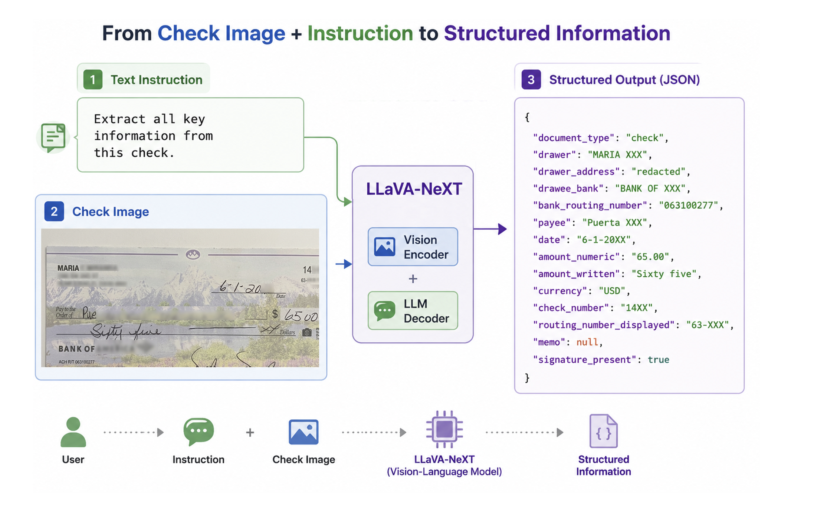
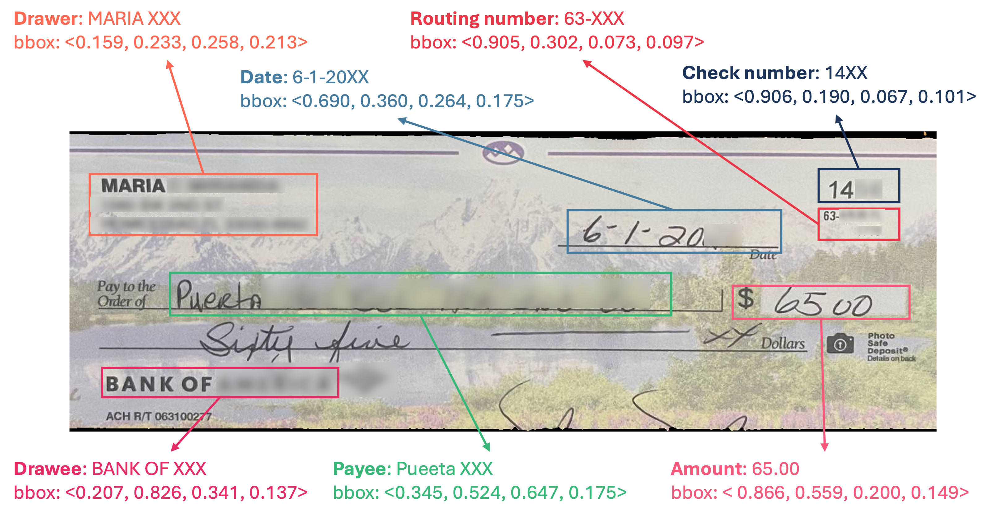

# CheckGuard I2T-VLM: Image-to-Text Structured Information Extraction with Vision-Language Models

In our [CIKM 2024](https://doi.org/10.1145/3627673.3679155) work, we introduced **CheckGuard**, a cross-modal benchmark for check information extraction. This repository extends that research toward **image-to-text (I2T) structured information extraction**: we build richly annotated check-image data and fine-tune a **Vision-Language Model (VLM)** to read check images and produce machine-readable structured outputs.

## Table of Contents

- [System Overview](#system-overview)
- [Dataset & Annotation Sample](#dataset--annotation-sample)
- [Introduction](#introduction)
- [Citation](#citation)
- [Data Access](#data-access)
- [Install](#install)

## System Overview

<p align="center">
  
</p>

**Input:** text instruction + check image  
**Model:** LLaVA-NeXT 
**Output:** structured JSON (e.g., `document_type`, `drawer`, `drawee_bank`, `payee`, `date`, `amount_numeric`, `amount_written`, `signature_present`, …)

## Dataset & Annotation Sample

Each sample pairs a check image with field-level supervision. Annotations include semantic labels and normalized bounding boxes `<x, y, w, h>` for regions such as drawer, drawee, payee, date, amount, routing number, and check number.

<p align="center">
  
</p>


## Introduction

Understanding financial documents requires more than conventional OCR. Models must jointly reason about visual appearance, document layout, handwritten content, and field semantics to accurately recover structured information for downstream financial applications.

Our pipeline has three stages:

1. **Dataset construction** — We curate check images with fine-grained annotations (field labels, normalized bounding boxes, and structured ground truth) for key attributes such as drawer, drawee, payee, date, amount, routing number, and check number.
2. **VLM fine-tuning** — We adapt **LLaVA-NeXT** on instruction-following image–text pairs so the model learns to extract structured information from full checks or field-specific sub-images.
3. **Structured extraction at inference** — Given a natural-language instruction (e.g., *"Extract all key information from this check."*) and a check image, the model outputs structured JSON with typed fields ready for downstream applications.

   Example output:

   ```json
   {
     "drawer": "MARIA XXX",
     "bank": "BANK OF XXX",
     "payee": "Puerta XXX",
     "date": "6-1-20XX",
     "amount": "$65.00",
     "routing_number": "063100277",
     "check_number": "14XX"
   }
   ```

## Citation

If you use this codebase or the CheckGuard benchmark, please cite our CIKM 2024 paper:

Fei Zhao, Jiawen Chen, Bin Huang, Chengcui Zhang, and Gary Warner. 2024. CheckGuard: Advancing Stolen Check Detection with a Cross-Modal Image-Text Benchmark Dataset. In Proceedings of the 33rd ACM International Conference on Information and Knowledge Management (CIKM '24). Association for Computing Machinery, New York, NY, USA, 5425–5429. https://doi.org/10.1145/3627673.3679155

## Data Access

For access, pls contact Dr. Chengcui Zhang (czhang02@uab.edu) and Gary Warner (gar@uab.edu). Thanks. 


## Install

If you are not using Linux, do *NOT* proceed, see instructions for [macOS](https://github.com/haotian-liu/LLaVA/blob/main/docs/macOS.md) and [Windows](https://github.com/haotian-liu/LLaVA/blob/main/docs/Windows.md).


1. Install Package
```Shell
conda create -n llava python=3.10 -y
conda activate llava
pip install --upgrade pip  # enable PEP 660 support
pip install -e .
```

2. Install additional packages for training cases
```
pip install -e ".[train]"
pip install flash-attn --no-build-isolation
```

### Upgrade to latest code base

```Shell
git pull
pip install -e .
conda install nb_conda_kernels

# if you see some import errors when you upgrade,
# please try running the command below (without #)
# pip install flash-attn --no-build-isolation --no-cache-dir

```

## Models

- All models are stored [here](https://huggingface.co/larry5/CheckGuard/tree/main).

## Data Loading Code

- The code for data loading is provided in the `data_visualization/data_loading.ipynb` file.


## Data Visualization Code

- The code for data visualization is provided in the `data_visualization/data_visualization.ipynb` file.

## Training Scripts

- All PEFT-based models' training scripts are stored in the `script-peft` folder in the repo.

## Inference

- To run inference with the PEFT models, please use the `inference.ipynb` file in the `cikm-resource` folder.

## Custom Data Training

- To train the model with your own data, use the following format:
    ```json
    [
        {
            "id": "ad555ef3-2b24-47e9-a12c-768d198f751a",
            "image": "03/dataset/images/train/photo_7167@25-02-2022_18-36-29_0.png",
            "conversations": [
                {
                    "from": "human",
                    "value": "<image>\nCan you tell me the dollar amount on this check?"
                },
                {
                    "from": "gpt",
                    "value": "The dollar amount on the check is $355.00."
                }
            ],
        },
        ...
    ]
    ```
- The data generation code is provided in `cikm-resource/generate_json/other_class.ipynb` file.


## PEFT Command for fine-tuning:


```Shell

# fine-tuning mistral model with two gpus
bash scripts_peft/mistral/lora/llava-lora-mistral-r128a256/wholeimage/bank_no/finetune_lora_llava_mistral.sh "0,1"  


```

Thanks to the authors of [LLaVA-1.5](https://github.com/haotian-liu/LLaVA) for their foundational code and contributions.

## Related Projects

- [Instruction Tuning with GPT-4](https://github.com/Instruction-Tuning-with-GPT-4/GPT-4-LLM)
- [LLaVA-Med: Training a Large Language-and-Vision Assistant for Biomedicine in One Day](https://github.com/microsoft/LLaVA-Med)
